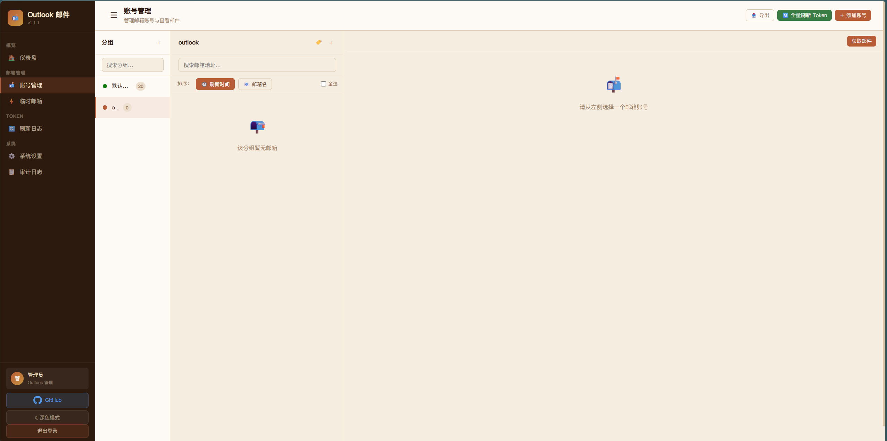

# Outlook Email Plus

个人自用的 Outlook 邮件管理工具，提供 Web 界面、多账号管理、邮件读取、验证码提取和简单的对外只读 API。

## 核心功能

- 多账号统一管理
- Outlook / IMAP 多链路读取
- 验证码和验证链接提取
- Token 定时刷新
- 分组、标签、搜索和批量操作
- 个人自用场景下的对外只读 API

## 快速开始

### Docker

```bash
docker pull ghcr.io/zeropointsix/outlook-email-plus:latest

docker run -d \
  --name outlook-email-plus \
  -p 5000:5000 \
  -v $(pwd)/data:/app/data \
  -e SECRET_KEY=your-secret-key-here \
  -e LOGIN_PASSWORD=your-login-password \
  ghcr.io/zeropointsix/outlook-email-plus:latest
```

PowerShell:

```powershell
docker run -d `
  --name outlook-email-plus `
  -p 5000:5000 `
  -v ${PWD}/data:/app/data `
  -e SECRET_KEY=your-secret-key-here `
  -e LOGIN_PASSWORD=your-login-password `
  ghcr.io/zeropointsix/outlook-email-plus:latest
```

### 本地运行

```bash
python -m venv .venv
pip install -r requirements.txt
python start.py
```

## 常用配置

| 变量名 | 说明 | 默认值 |
|--------|------|--------|
| `SECRET_KEY` | 会话密钥，生产环境必须自行设置 | 无 |
| `LOGIN_PASSWORD` | 后台登录密码 | `admin123` |
| `PORT` | 监听端口 | `5000` |
| `HOST` | 监听地址 | `0.0.0.0` |
| `DATABASE_PATH` | SQLite 数据库路径 | `data/outlook_accounts.db` |

生成 `SECRET_KEY`：

```bash
python -c "import secrets; print(secrets.token_hex(32))"
```

## 使用说明

1. 配置 Outlook 账号的 `client_id` 和 `refresh_token`
2. 导入邮箱账号
3. 在页面中查看邮件、提取验证码或管理分组
4. 如需自动刷新，打开定时刷新配置

账号导入的常见格式：

```text
user@outlook.com----password123----client_id----refresh_token
```

## 对外 API

项目提供 `/api/external/*` 只读接口，适合个人自用或受控环境调用。

- 邮件列表和邮件详情
- 验证码和验证链接提取
- 健康检查和账号状态查询

不建议直接公网裸露使用。若需要外部调用，建议至少放在反向代理和受控网络之后。

## 界面预览





## 技术栈

- Flask
- SQLite
- Microsoft Graph API
- APScheduler
- 原生 JavaScript

## 许可证

MIT
